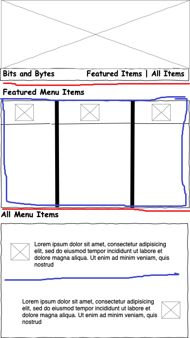

# Flexbox

## New Bits & Bytes Site Layout

- 3 main rows of content 
- No distinct columns of fixed size (Not good candidate for CSS Grid - unlike yesterday's)
    - menu columns should be based on content size not fixed width

## Session objectives

- Lay out a series of elements using Flexbox
    - Define a Flexbox container using a row or a column
    - Apply normal flow to Flexbox items using `flex-wrap`
    - Apply content alignment to flex items using `justify-content` and `align-items`
    - Arrange items within a Flexbox container using `order`
    - Size items within a Flexbox container using `flex-basis`, `flex-grow`, `flex-shrink`
- Understand how to add Flexbox layouts to existing Responsive CSS Grid layouts
- Understand when to use Flexbox or Grid or combine them both